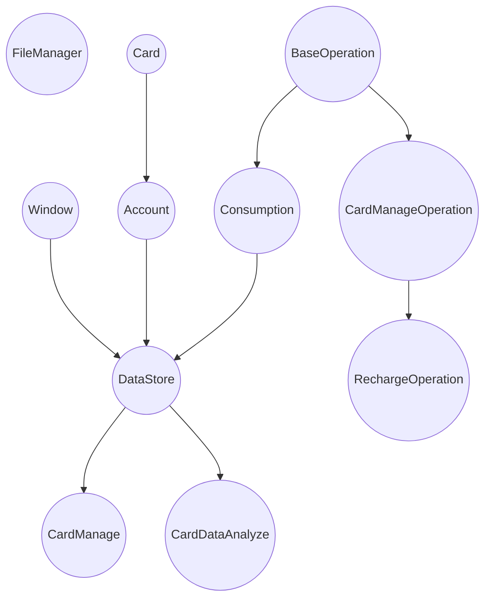
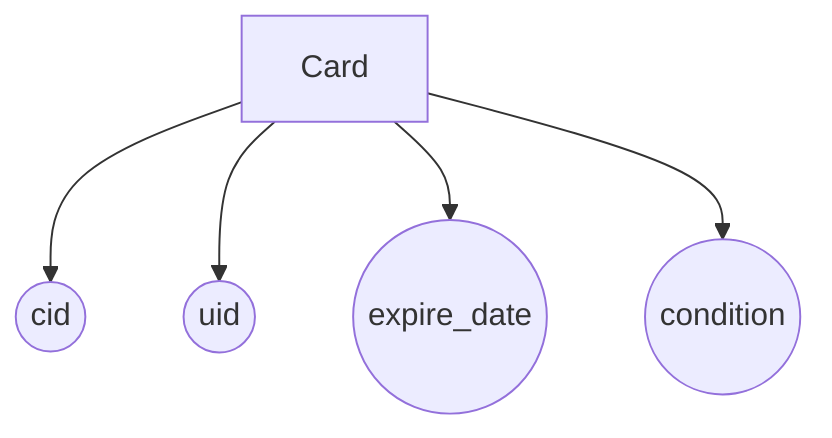
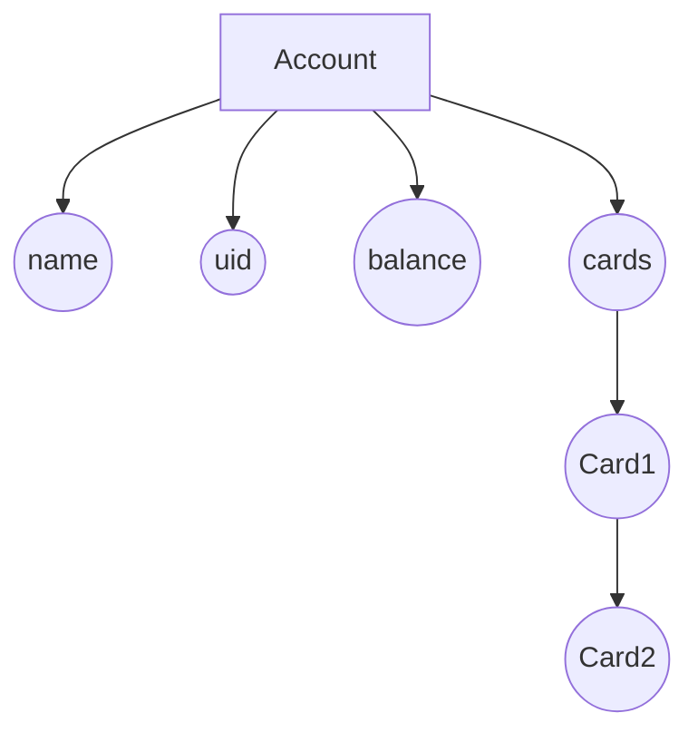
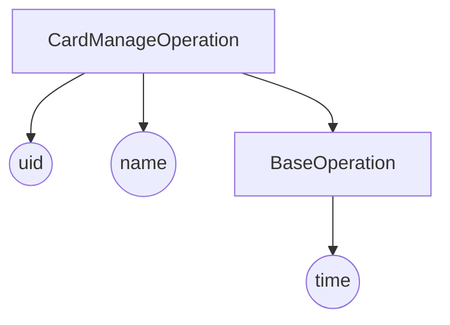
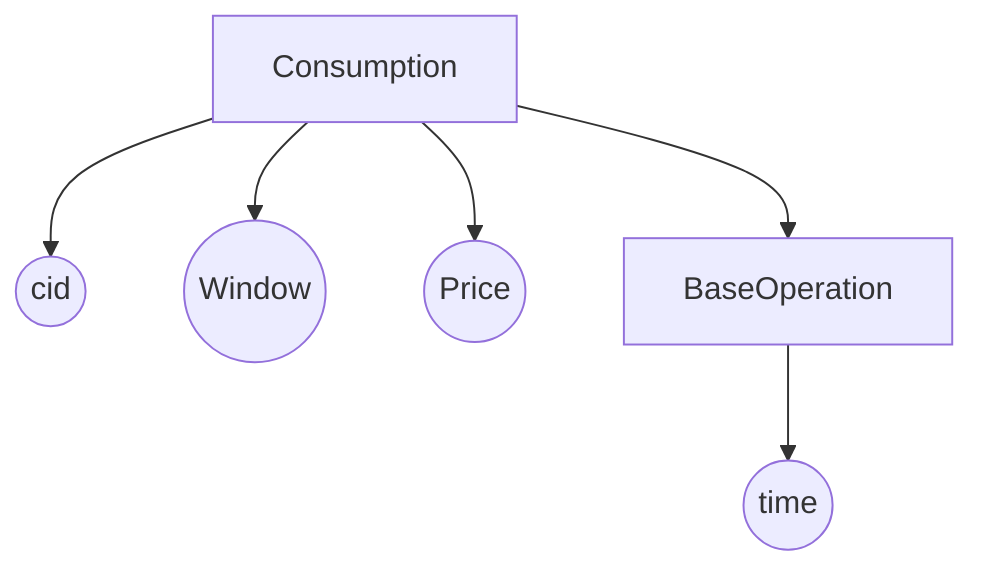
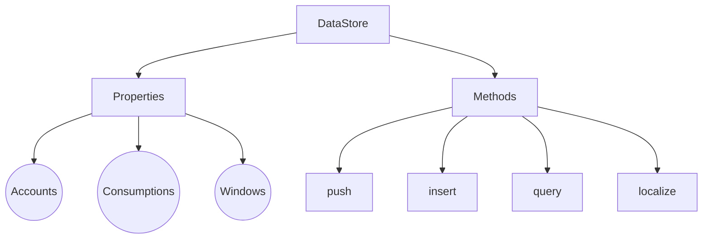

# CampusCardBackEnd

模拟HUST智慧校园卡系统

## Current Project Structure

|        Name         |                 Function                 |
|:-------------------:|:----------------------------------------:|
|     FileManager     |             control files io             |
|        Card         |          store campusCard data           |
|       Account       |               store cards                |
|    BaseOperation    |            sortable operation            |
| CardManageOperation |      manage card related operations      |
|     Consumption     |   a data bound to a card and a window    |
|      DataStore      | store windows, accounts and consumptions |
|       Consume       |   construct consumption into dataStore   |
|     CardManage      |    construct card relative operation     |
|   CardDataAnalyze   |            analyze card data             |

FileManager是对fstream的包装，控制文件的读写操作，e.g. 初始数据文件读入、log文件写入、数据Localization。 Account对象中有以链表方式储存的Card、学号、名字等信息。

BaseOperation为基本的操作对象，只含有Time字段，重写operator >、< 使其对时间sortable；定义了to_string、hash_value等虚（接口）函数，使其logable、recheckable。

CardManageOperation派生自BaseOperation，类中定义了enum：OperationName，e.g. 挂失、充值。类中增加了operator字段（实质为Uid）、operationName字段。

RechargeOperation派生自CardManegeOperation，增加了price字段，constructor默认构造其OperationName为Recharge。

Consumption继承自BaseOperation，增加了cid、window、price字段，分别表示operator、当前消费窗口、消费金钱。

所有数据（i.e. 当前窗口位置、所有窗口消费、所有账户）均储存在DataStore中，an DataBase liked Object，统一对数据进行管理操作、定义了其中数据基本的增删插改Api。

CardDataAnalyze通过对DataStore Api的调用，识别、分析数据特征来得出结果。

CardManage通过对DataStore Api的调用，对卡进行管理、包括开户、挂失、充值、消费等操作。



### Card

|    Name     |                    Function                     |
|:-----------:|:-----------------------------------------------:|
|  password   |                 account passwd                  |
| expire_date |                   expire time                   |
|     cid     |                 card identifier                 |
|     uid     |                   student id                    |
|  condition  | true represents valid, false represents invalid |

### Window
```c 
typedef unsigned int Window;
//唯一辨识id 表现为窗口号
```

### Account



### CardManageOperation

> enum OperationName: char
> { 充值, 挂失, 解挂, 销户, 补卡 }
> ```c
> typedef unsigned long long Time;// 观察源数据表示的日期，认为用ull来表示最为合适
> ```


> Note: CardManageOperation指向BaseOperation的箭头并非表示继承
> 而是表示拥有父类的字段名，下同
### Consumption


### DataStore



### Utils
#### MergeSort
对任意值类型comparable的pointer类型进行排序

实现了两种方法
+ 分治归并：
  
  将 k 个数组配对并将同一对中的数组合并，
  第一轮合并以后， k 个数组被合并成了 k / 2 个数组，
  平均长度为 2n / k ，然后是 k / 4 个数组， k / 8 个数组等等，
  重复这一过程，直到得到了最终的有序数组
+ 多路归并：

  维护当前每个数组没有被合并的元素的最前面一个，k 个数组就最多有 k 个满足这样条件的元素，
  每次在这些元素里面选取 val 属性最小的元素合并到答案中，使用优先队列来优化
#### CircularArray
对任意pointer类型进行循环储存，未装填的位置为`nullptr`，constructor如下
```c++
inline explicit CircularArray(Size size, Subscript start = 0) : size(size), start_index(start) {
    if (start >= size)
        throw;
    current_index = start;
    _data = new ValueType[size];
};
```
`start_index`为循环数组开始装填的位置，系统中对应为窗口起始位置
自定义循环数组折半查找
```c++
/// return subscript meet that condition
/// for example, compare = 3, array is 0, 1, 2, 2, 3
/// return 3 whose subscript of value **last** less than 3
template<class value_t>/// value_t must comparable with value type of the pointer
[[nodiscard]] inline Subscript halfSearch(value_t compare) const
```
自定义循环数组插入（先折半查找，再移动后续元素，再插入）
```c++
/* Massive memory movement, ValueType must comparable */
inline void insert(ValueType value)
```
自定义了for_loop函数用于遍历数组内非null值
```c++
typedef std::function<void(const unsigned int &index, const ValueType &value)> Range;
// only iterate none null values
void for_loop(const Range &range) const
```
#### JoinableMultiWork
用于初始化数据，将已分成多个文件的消费等数据多线程读入内存，constructor如下
```c++
typedef std::function<void(void)>* Tasks;
/* no lock, so each work should not affect others */
JoinableMultiWork(size_t thread_count, int work_count, Tasks tasks)
```