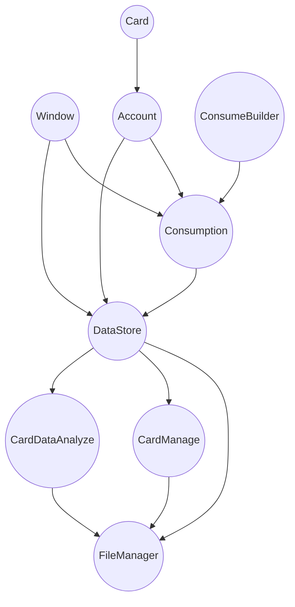

# CampusCardBackEnd
 模拟HUST智慧校园卡系统

## Current Project Structure
|      Name       |                Function                |
|:---------------:|:--------------------------------------:|
|   FileManager   |            controls file io            |
|     Window      |          window id of a cafe           |
|      Card       |         stores campusCard data         |
|     Account     |              stores cards              |
|     Consume     |  a data bound to a card and a window   |
| ConsumeBuilder  | construct a consume data into database |
|    DataStore    |   stores windows, accounts, consumes   |
|   CardManage    |     manage card relative operation     |
| CardDataAnalyze |              analyze data              |

