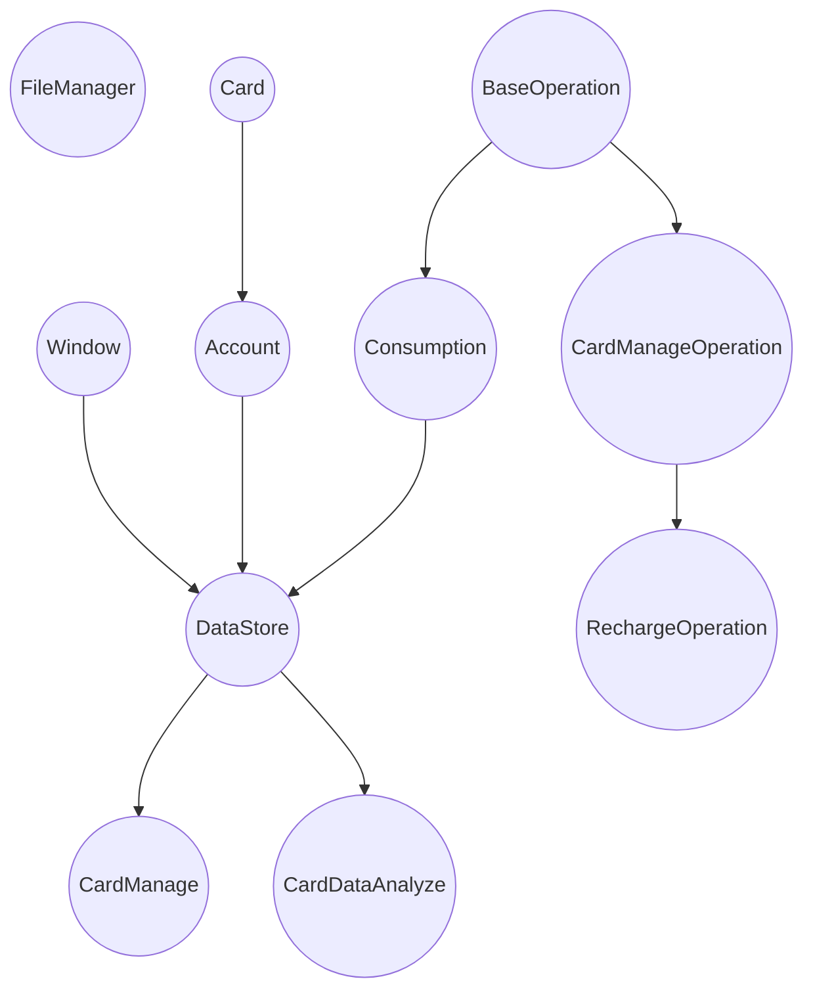

# CampusCardBackEnd

模拟HUST智慧校园卡系统

## Current Project Structure

|        Name         |                 Function                 |
|:-------------------:|:----------------------------------------:|
|     FileManager     |             control files io             |
|        Card         |          store campusCard data           |
|       Account       |               store cards                |
|    BaseOperation    |            sortable operation            |
| CardManageOperation |      manage card related operations      |
|     Consumption     |   a data bound to a card and a window    |
|      DataStore      | store windows, accounts and consumptions |
|       Consume       |   construct consumption into dataStore   |
|     CardManage      |    construct card relative operation     |
|   CardDataAnalyze   |            analyze card data             |

