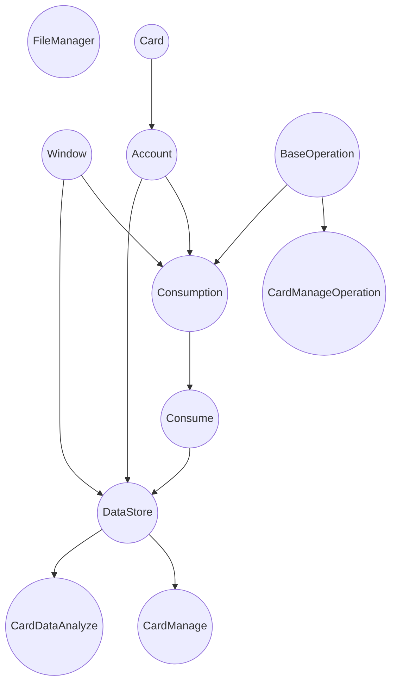

# CampusCardBackEnd

模拟HUST智慧校园卡系统

## Current Project Structure

|        Name         |                Function                 |
|:-------------------:|:---------------------------------------:|
|     FileManager     |            controls file io             |
|        Card         |         stores campusCard data          |
|       Account       |              stores cards               |
|    BaseOperation    |           sortable operation            |
| CardManageOperation |   management card related operations    |
|     Consumption     |   a data bound to a card and a window   |
|       Consume       | construct a consume data into dataStore |
|      DataStore      |  stores windows, accounts and consumes  |
|     CardManage      |     manage card relative operation      |
|   CardDataAnalyze   |              analyze data               |

